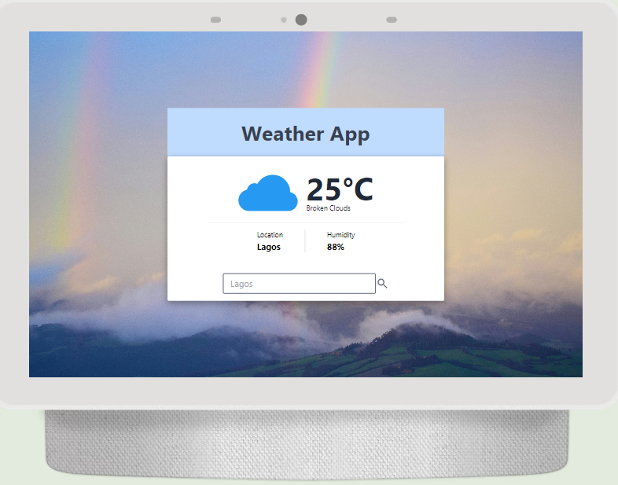
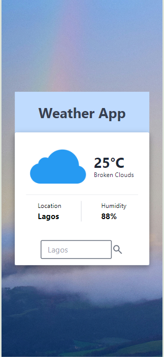

# Day 6: Building a Weather App


## Challenge Task
Today's focus is on mastering API integration, state management, and UI design in React JS. The goal is to build a simple weather app that fetches data from a weather API and displays it in a user-friendly interface.

## Instructions

### Learning Session

- **Fetching Data with React:** Understand how to make HTTP requests to an external API and handle responses.
- **State Management in React:** Learn to manage state in React components using hooks like `useState`.
- **Creating Simple and Responsive UIs in React:** Build a user interface that is intuitive and responsive.

Review the concepts of API integration, state management, and UI design. Take notes or jot down key points for quick reference.

### Activity

1. **Setup Your React Environment:** Initialize a React app using `create-react-app` or your preferred setup.

2. **Obtain API Key:**
   - Sign up for a free weather API (e.g., OpenWeatherMap).
   - Obtain an API key from the service.

3. **Create `WeatherApp` Component:**
   - Create a new React component named `WeatherApp`.

4. **Build the UI:**
   - **Input Field:** For the user to enter a city name.
   - **Fetch Button:** To trigger the data fetch.
   - **Display Area:** For showing the weather information (e.g., temperature, humidity, weather condition).

5. **Implement State Management:**
   - Manage the input value and the fetched weather data using React's state management.

6. **Fetch Weather Data:**
   - Fetch data from the API based on the user's input city name.
   - Use the API key securely stored in your `.env` file.

7. **Display Weather Information:**
   - Show the fetched weather data in a user-friendly format.

8. **Handle Errors:**
   - Provide appropriate feedback to users in case of errors or invalid city names.

## Technologies Used

- **React JS:** For building the user interface.
- **OpenWeatherMap API:** For fetching weather data.
- **Tailwind** 
- **JavaScript:** For handling asynchronous operations and state management.

## Screenshots




## Live Link

[View Live Demo](https://weather-p37ycot9u-onuorachidimma4gmailcoms-projects.vercel.app/)
- Enter any city name in the input field and click on the search icon to see the current weather information.

## Setup Instructions

1. **Clone the repository:**
   ```bash
   git clone https://github.com/your-username/weather-app.git


## Getting Started with Create React App

This project was bootstrapped with [Create React App](https://github.com/facebook/create-react-app).

## Available Scripts

In the project directory, you can run:

### `npm start`

Runs the app in the development mode.\
Open [http://localhost:3000](http://localhost:3000) to view it in your browser.

The page will reload when you make changes.\
You may also see any lint errors in the console.

### `npm test`

Launches the test runner in the interactive watch mode.\
See the section about [running tests](https://facebook.github.io/create-react-app/docs/running-tests) for more information.

### `npm run build`

Builds the app for production to the `build` folder.\
It correctly bundles React in production mode and optimizes the build for the best performance.

The build is minified and the filenames include the hashes.\
Your app is ready to be deployed!

See the section about [deployment](https://facebook.github.io/create-react-app/docs/deployment) for more information.

### `npm run eject`

**Note: this is a one-way operation. Once you `eject`, you can't go back!**

If you aren't satisfied with the build tool and configuration choices, you can `eject` at any time. This command will remove the single build dependency from your project.

Instead, it will copy all the configuration files and the transitive dependencies (webpack, Babel, ESLint, etc) right into your project so you have full control over them. All of the commands except `eject` will still work, but they will point to the copied scripts so you can tweak them. At this point you're on your own.

You don't have to ever use `eject`. The curated feature set is suitable for small and middle deployments, and you shouldn't feel obligated to use this feature. However we understand that this tool wouldn't be useful if you couldn't customize it when you are ready for it.

## Learn More

You can learn more in the [Create React App documentation](https://facebook.github.io/create-react-app/docs/getting-started).

To learn React, check out the [React documentation](https://reactjs.org/).

### Code Splitting

This section has moved here: [https://facebook.github.io/create-react-app/docs/code-splitting](https://facebook.github.io/create-react-app/docs/code-splitting)

### Analyzing the Bundle Size

This section has moved here: [https://facebook.github.io/create-react-app/docs/analyzing-the-bundle-size](https://facebook.github.io/create-react-app/docs/analyzing-the-bundle-size)

### Making a Progressive Web App

This section has moved here: [https://facebook.github.io/create-react-app/docs/making-a-progressive-web-app](https://facebook.github.io/create-react-app/docs/making-a-progressive-web-app)

### Advanced Configuration

This section has moved here: [https://facebook.github.io/create-react-app/docs/advanced-configuration](https://facebook.github.io/create-react-app/docs/advanced-configuration)

### Deployment

This section has moved here: [https://facebook.github.io/create-react-app/docs/deployment](https://facebook.github.io/create-react-app/docs/deployment)

### `npm run build` fails to minify

This section has moved here: [https://facebook.github.io/create-react-app/docs/troubleshooting#npm-run-build-fails-to-minify](https://facebook.github.io/create-react-app/docs/troubleshooting#npm-run-build-fails-to-minify)
